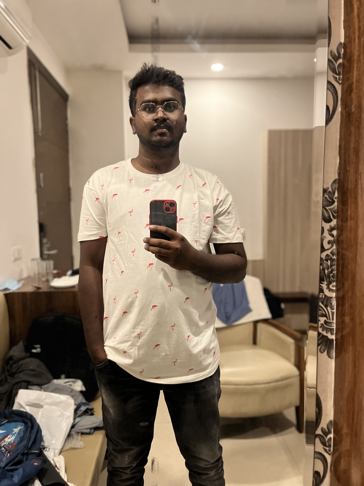

# Neerazsai Veeranki

I'm a travel enthusiast who loves to go on a very long road trips, eespecially on motorcycles. I recently got this interest after seeing, people travelling places around the world. my dream is to explore an unexplored place and its beauty on motorcycle. Ofcourse its a very stressfull and energy consuming thing to drive for that long periods of time, but i believe with a right company of friends it would be a life time memory to cherish.

### Places I would suggest you to visit 

Here the following table has the data of places that are worth of exploring, its city and amount of time you can spend on exploring it.

| Name of City | Location to Visit | Time to Spend |
|    :---:     |      :---:        |    :---:      |
|   Hyderabad  | salar jung museum |    3-4 hours  |
|   Pondicherry|Promenade Beach    |sunrise/sunset |
|   Vijayawada | Durga tempple     |    1-2 hours  |
|   Ladakh     | pangong lake      |    1 day      |

### Quotes that define Life
 

> The meaning of life is just to be alive. It is so plain and so obvious and so simple. 
-- _Alan Watts_

 

> Everything is done with a goal, and that goal is "good".  
-- _Aristotle_

